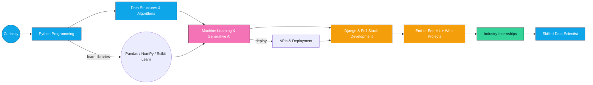

<!-- 🚀 Modern Animated Header | Data Science & ML Enthusiast -->

<!-- Typing Animation Header -->
<h1 align="center">
  
</h1>

<h1 align="center">Hi, I'm Aditya Pareek! 👋</h1>

<p align="center" style="font-size:1.05em">
  <b>🚀 Data Science Learner</b> &nbsp;|&nbsp; 
  <b>🤖 Machine Learning Explorer</b> &nbsp;|&nbsp; 
  <b>🧠 Python Developer</b>
</p>

---

## 🧬 My Tech Story: Learning, Building & Innovating (Horizontal Roadmap)

<!-- Mermaid horizontal roadmap (LR). This is GitHub-compatible Mermaid -->

🚀 About Me

🎓 B.Tech CSE student (CGPA: 9.69)
💡 Passionate about Machine Learning, Data Analytics, and Full-Stack Django Development
📊 Worked on real-world ML projects (classification, regression, clustering)
🛠️ Experience in Python Development & Data Science internships

I enjoy solving problems, building impactful ML models, and creating modern web applications.

🛠️ Tech Stack
Languages

Python • C++ • Java • SQL • HTML/CSS

ML & Data Tools

Scikit-learn • Pandas • NumPy • Matplotlib • Seaborn

Frameworks

Django • Bootstrap

Tools

Power BI • Excel • Git • VS Code • Jupyter Notebook

📌 Projects
🔹 Mini-Tweet — Microblogging Web App

Django • SQLite • Bootstrap
CRUD for tweets, user authentication, responsive UI, MVT architecture.

🔹 Diabetes Prediction Model

85% accuracy → Logistic Regression + KNN
Feature engineering + preprocessing + visualization.

🔹 Customer Churn Prediction

80% accuracy → Random Forest + Logistic Regression
EDA + churn indicator analysis.

🏆 Certifications

IBM: Python for Data Science • Data Analysis • Data Visualization

IIT Bombay: Python Training

Deloitte: Data Analytics Simulation

Infosys: Data Science Foundation

EY & Microsoft: AI Skills Passport

Simplilearn: Power BI & Git Training


<div align="center"> <!-- A banner-style horizontal roadmap made from badges and short labels -->

🏆 Certifications & Badges

Below are my Credly badges — click any badge to view the official credential page.

<p align="center"> <!-- Badge 1 --> <a href="https://www.credly.com/badges/61723d92-b0d7-40d0-a327-617488f714ba/public_url" target="_blank" rel="noopener">  </a> &nbsp; <!-- Badge 2 --> <a href="https://www.credly.com/badges/378556cc-c14f-42ea-8d5d-604a75151936/public_url" target="_blank" rel="noopener">  </a> &nbsp; <!-- Badge 3 --> <a href="https://www.credly.com/badges/54c655dc-4625-4a72-8a16-94244a21e95c/public_url" target="_blank" rel="noopener">  </a> &nbsp; <!-- Badge 4 --> <a href="https://www.credly.com/badges/a839cedc-66b0-4010-84aa-40a3802321d5/public_url" target="_blank" rel="noopener">  </a> </p>
</div>
📡 Connect With Me
<p align="center"> <a href="mailto:adityapareek7412@gmail.com"></a> <a href="https://github.com/AdityaPareek7412"></a> <a href="https://www.linkedin.com/in/aditya-pareek-"></a> </p>
<h3 align="center">⭐ Thanks for visiting my profile! Feel free to star my repositories!</h3> ```
