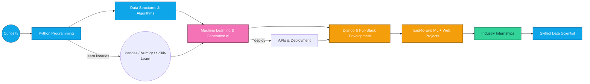

<!-- 🚀 Modern Animated Header | Data Science & ML Enthusiast -->

<!-- Typing Animation Header -->
<h1 align="center">
  
</h1>

<h1 align="center">Hi, I'm Aditya Pareek! 👋</h1>

  <b>🚀 Data Science Learner</b> &nbsp;|&nbsp; 
  <b>🤖 Machine Learning Explorer</b> &nbsp;|&nbsp; 
  <b>🧠 Python Developer</b>

---

## 🧬 My Tech Story: Learning, Building & Innovating (Horizontal Roadmap)

<!-- Mermaid horizontal roadmap (LR). This is GitHub-compatible Mermaid -->

🚀 About Me

🎓 B.Tech CSE student (CGPA: 9.69)
💡 Passionate about Machine Learning, Data Analytics, and Full-Stack Django Development
📊 Worked on real-world ML projects (classification, regression, clustering)
🛠️ Experience in Python Development & Data Science internships

I enjoy solving problems, building impactful ML models, and creating modern web applications.

# ⚡ Aditya Pareek — Data Science & ML Engineer

🚀 *Turning data into decisions • Models into products • Code into impact*

---

## 💡 Technical Skills ->

---

## ⚡ Highlight Reel

- 🚀 Built **end-to-end ML pipelines** from raw data to deployed models  
- 📊 Delivered **business-ready insights** using EDA & visualization  
- 🤖 Improved prediction accuracy using **feature engineering & model tuning**  
- 🧠 Hands-on experience with **classification & churn analysis problems**  
- 🔁 My rule: *If it can be automated — I automate it*

---

## 📌 Projects

### 🔹 Mini-Tweet — Microblogging Web App
**Tech:** Django • SQLite • Bootstrap  
- CRUD operations for tweets  
- Secure user authentication  
- Responsive UI  
- Clean MVT architecture  

---

### 🔹 Diabetes Prediction Model
**Accuracy:** ⭐ **85%**  
- Logistic Regression + KNN  
- Feature engineering & preprocessing  
- Visual analysis for insights  

---

### 🔹 Customer Churn Prediction
**Accuracy:** ⭐ **80%**  
- Random Forest + Logistic Regression  
- Exploratory Data Analysis (EDA)  
- Churn indicator analysis  

---

## 🏆 Certifications

- 🟢 **IBM** — Python for Data Science  
- 🟢 **IBM** — Data Analysis  
- 🟢 **IBM** — Data Visualization  
- 🔵 **IIT Bombay** — Python Training  
- 🟡 **Deloitte** — Data Analytics Simulation  
- 🟣 **Infosys** — Data Science Foundation  
- 🔷 **EY & Microsoft** — AI Skills Passport  
- 🟠 **Simplilearn** — Power BI & Git Training  

---

## 🔥 GitHub Dashboard

  
  

---

 <!-- A banner-style horizontal roadmap made from badges and short labels -->

🏆 Certifications & Badges

Below are my Credly badges — click any badge to view the official credential page.

 <!-- Badge 1 -->  &nbsp; <!-- Badge 2 -->  &nbsp; <!-- Badge 3 -->  &nbsp; <!-- Badge 4 -->  

## 🚀 Final Note

⭐ Passionate about **Data Science, ML, and real-world problem solving**  
📌 Always learning, always building  

**Let’s connect & build something impactful!**

📡 Connect With Me

    

<h3 align="center">⭐ Thanks for visiting my profile! Feel free to star my repositories!</h3> 
